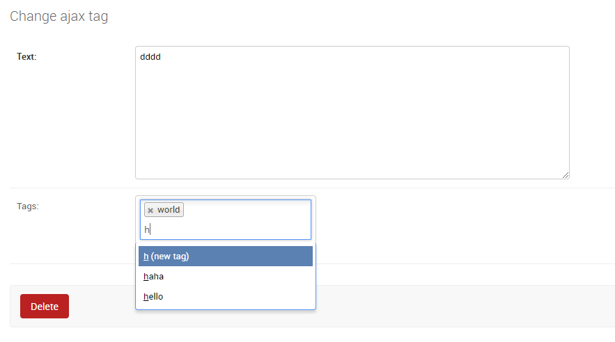

# fancytag

Its a widget for django-taggit. Some code is copied from https://github.com/Fantomas42/django-blog-zinnia.

There are two widget:

1. A widget for a better representation for tag. You can user FancyTaggableManager just like TaggableManager, or use FancyTagMixin.
2. A dynamicly loaded tags use Ajax. You can user FancyAjaxTaggableManager just like TaggableManager, or use FancyAjaxTagMixin. 
  But you need to ada a URL to enable the REST url. 
  `url(r'^fancytag/', include('fancytag.urls', namespace='fancytag')),`

screenshot:

You can find out the usage in this commit: https://github.com/sadnoodles/fancytag/commit/2019355cce15d2fe529cfa6b1210ca1f6c1dcbf4